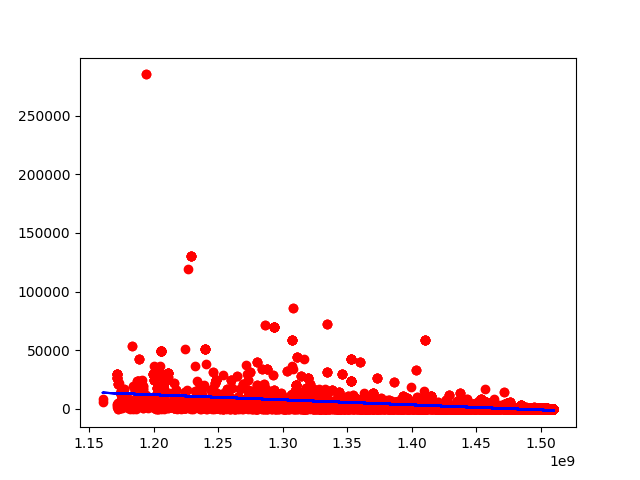

# Business Intelligence Assignment 5 - Machine Learning

## Part 1   - Training Model and Scatter Plot
`y = ax + b`  
What does the `a` value mean: The `a` value is the value of `y` when `x` is equal to 0. If `x` is never zero, then this value is not relevant.   
What does the `b` value mean: `b` is the coeffecient of `x`. It determines how much `y` changes for each one-unit change to `x`.  
  
`a: -4.3054089103938141e-05`  
`b: 63661.886865183958`  
```python
def trainAndPlot():
    X,y = TRAIN_CREATED, train_karma
    x = train_created
    model = linear_model.LinearRegression()
    model.fit(X, y)
    fit = np.polyfit(x, y, deg=1)
    fit_fn = np.poly1d(fit)
    plt.plot(X, y, 'ro', X, fit_fn(X), 'b')
    plt.show()
    print("a: ", model.coef_[0])
    print("b: ", model.intercept_)
```
## Part 2 - Mean Absolute Error
The result numbers tell us that the average difference between the data-set containing actual data (training and testing), and the data set containing predicted data is about `4535`.  
The difference between the 2 results; `4535` and `4363` comes due to them containing different data. If both data-sets were identical, then the results would also be.  
`MAE (training): 4535.2278195244253`   
`MAE (testing): 4363.9936837520208`  
```python
def calcMAE():
    train_karma_pred = model.predict(TRAIN_CREATED)
    test_karma_pred = model.predict(TEST_CREATED)
    train_MAE = mean_absolute_error(train_karma, train_karma_pred)
    test_MAE = mean_absolute_error(test_karma, test_karma_pred)
```
## Part 3 - Mean Squared Error  
Write about MSE  
`MSE (training): 104656390.75364754`   
`MSE (testing): 61750043.01901821`  
```python
def calcMSE():
    train_karma_pred = model.predict(TRAIN_CREATED)
    test_karma_pred = model.predict(TEST_CREATED)
    train_MSE = mean_squared_error(train_karma, train_karma_pred)
    test_MSE = mean_squared_error(test_karma, test_karma_pred)
```
## Part 4 - Pearson's r
Write about Pearson's r  
`r (training): -0.35941580366452558`   
`r (testing): -0.36569769103632976`  
```python
def calcPR():
    train_PR = pearsonr(train_created, train_karma)
    test_PR = pearsonr(test_created, test_karma)
```
## Part 5 - Predictions
